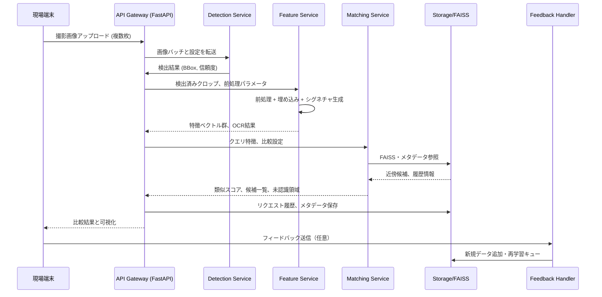
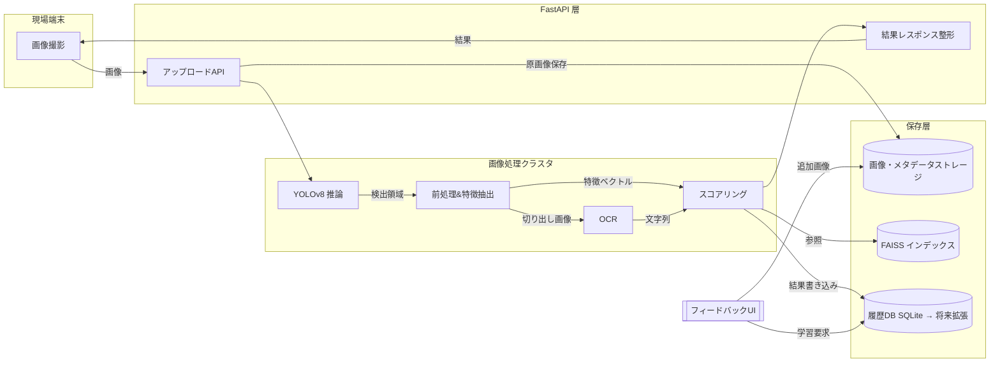

# フェーズ0 成果物まとめ

本ドキュメントは、Miwakerukun プロジェクトにおけるフェーズ0（調査・設計固め）の成果物を整理したものです。現段階で確定した前提・方針は今後の開発フェーズでの意思決定の基礎となります。必要に応じてステークホルダーと共有し、追加確認を進めます。

## 1. 要件の再確認と利用モデル選定

### 1.1 想定するユースケースと前提

- 対象: ブランドバッグ等の高額商品を撮影し、既存DBとの照合によって真贋や類似品を判定するワークフローを想定。
- 入力: 現場スタッフがスマートフォンまたはタブレットで撮影した複数枚の画像（全体・刻印・ロゴ・シリアルなど）。
- 出力: 類似候補上位N件、スコア内訳、未認識領域のハイライト、追加学習用のフィードバック登録。
- 非機能要件（暫定）:
  - 1リクエストあたり30秒以内（撮影〜APIレスポンスまで）で回答。
  - 店舗回線を想定して上り 10 Mbps 程度でも処理可能とする。
  - 取り扱いブランド20種類、1ブランドあたり最低50件の比較対象データを確保。

### 1.2 モデル候補とライセンス整理

| 機能 | 候補モデル | 主な利点 | 想定課題 | ライセンス |
| --- | --- | --- | --- | --- |
| 物体検出 | Ultralytics YOLOv8n | GPU/CPU両対応、軽量でリアルタイム性が高い、サンプル・コミュニティが豊富 | 商用利用時はAGPLv3に注意。高精度が必要な部位では追加学習が必須 | AGPLv3（Ultralytics社ライセンス）。商用利用の場合は企業ライセンスを検討 |
| 物体検出（バックアップ） | YOLOv8s | n版より高精度、同一フレームワークで切り替え容易 | パラメータ数が増え、CPUのみ環境ではレイテンシ悪化 | AGPLv3 |
| 埋め込み特徴 | MobileNetV3-Large (torchvision) | 軽量、ImageNet事前学習済みで転移学習が容易、CPU対応が良い | 類似度精度が高精度モデルに劣る可能性 | BSD-3-Clause (PyTorch/Torchvision) |
| 埋め込み特徴（高精度案） | OpenCLIP ViT-B/32 | テキスト／画像クロスモーダル対応で拡張性あり | モデルサイズが大きくGPU必須、推論コストが高い | OpenCLIP (Apache-2.0 / MIT) |
| OCR | Tesseract OCR 5.x | OSSコミュニティが活発、日本語対応訓練データあり、オンプレで完結 | 高精度なレイアウト解析は外部ツール併用が必要 | Apache License 2.0 |
| OCR（代替） | EasyOCR | Pythonラッパーで利用容易、マルチランゲージ対応 | GPUが無い環境だと処理時間が長い。精度向上には追加学習が必要 | Apache License 2.0 |

### 1.3 採用方針

- **検出**: 初期プロトタイプでは Ultralytics YOLOv8n を採用し、GPU搭載環境では必要に応じて YOLOv8s に切り替えて精度を補う。商用化時にはUltralytics社のエンタープライズライセンス取得可否を検討する。
- **埋め込み**: ベースラインとして MobileNetV3-Large を利用し、精度指標が閾値を満たさない場合は OpenCLIP 系モデルへの乗り換えまたは二段階特徴量（グローバル＋局所）を検討する。
- **OCR**: オフライン運用を優先して Tesseract OCR を標準とし、難読フォントや刻印に対しては EasyOCR をフォールバック用に組み込む。

## 2. プロトタイプ運用フロー設計

### 2.1 シーケンス図

### 2.2 データフロー図

## 3. ハードウェア前提と計測指標

### 3.1 ハードウェア前提

| 役割 | 推奨スペック | 備考 |
| --- | --- | --- |
| 最小構成 (PoC) | CPU: 8 vCPU / RAM: 32 GB / GPU: なし / ストレージ: SSD 200 GB | CPUのみでYOLOv8nを運用。処理遅延は10〜15秒/画像程度を想定。 |
| 推奨構成 (本番想定) | CPU: 16 vCPU / RAM: 64 GB / GPU: NVIDIA RTX A4000以上 (VRAM 16 GB) / ストレージ: NVMe 1 TB | バッチ処理で1リクエストあたり3〜5秒の応答を目指す。FAISSはRAM常駐を前提。 |
| データ保存 | オブジェクトストレージ (S3互換) + 週間バックアップ | オフライン店舗向けにはNAS等を組み合わせる。 |

### 3.2 計測指標 (KPI/KQI)

- **レイテンシ**: 画像アップロード完了から結果レスポンスまでの総時間（P95で10秒以下を目指す）。
- **サービング内訳**: 検出処理時間、前処理＋特徴抽出時間、マッチング時間を個別に計測。
- **精度指標**:
  - 検出: mAP@0.5、リコール（重要部位の検出漏れ率 < 5%）。
  - 類似度: Top-1 正解率、Top-5 正解率、コサイン類似度閾値による再現率/適合率。
  - OCR: 文字列のCER/WER。
- **システム指標**: GPU利用率、CPU利用率、メモリ使用量、FAISSクエリ時間。
- **安定性指標**: エラー率 (<1%)、タイムアウト率 (<0.5%)。

計測は Prometheus + Grafana を想定し、最小構成では FastAPI の計測ミドルウェア + Loki などで代替する。

## 4. テスト用サンプルデータセットの準備方針

1. **収集範囲**
   - 主要ブランド（例: Louis Vuitton, Chanel, Gucci, Hermes, Prada）を中心に最低5ブランドから開始。
   - 各ブランドにつき "外観全体"、"刻印/ロゴ"、"素材アップ"、"シリアル" の4カテゴリで画像を用意。
2. **データボリューム**
   - 初期PoC: 1ブランドあたり 50件 × 4カテゴリ = 200枚 (計1,000枚程度)。
   - 本番準備: 10ブランドまで拡大し、1ブランド 200件を目標 (計8,000枚)。
3. **アノテーション方針**
   - YOLO形式 (COCO互換) のバウンディングボックス。
   - OCR対象領域はポリゴンアノテーション（LabelMe等で管理）。
   - 類似検索用にはメタデータ（ブランド、モデル名、年式、カラーバリエーション、素材）をCSVで管理。
4. **品質管理**
   - 二重チェック体制（アノテータ → レビューア）。
   - 撮影条件 (照明、背景、角度) をテンプレート化し、撮影ガイドラインを別途整備。
5. **バージョン管理**
   - DVC もしくは Git LFS を用いたデータバージョン管理を検討。
   - サンプルデータは `data/samples/` 配下に保存し、メタデータCSVと同期。

## 5. リスクと今後のアクション

- **ライセンスリスク**: YOLOv8のAGPLv3準拠が必要。PoC段階ではOSS版を利用し、事業化判断の前にUltralyticsライセンスを確認する。
- **精度不足の懸念**: MobileNetベースの埋め込みで十分な識別力が得られない場合、教師データの拡充と局所特徴量（SIFT/ORB）とのハイブリッドを検証する。
- **データ不足**: ブランド別の高品質データ確保が難しい場合は、メーカー協力や中古市場データの利用許諾を取り付ける必要がある。
- **ハードウェア確保**: GPU付きオンプレ環境の調達リードタイムを考慮し、クラウドGPUの暫定利用や推論簡略化案を準備する。

今後、フェーズ1へ移行する前に以下を実施する。

1. ステークホルダーへのレビュー共有とフィードバック収集。
2. データセット収集担当者とのキックオフ。
3. ハードウェア調達・クラウド構成案の見積もり取得。
4. フェーズ1のディレクトリ構成ドラフト作成。

以上でフェーズ0の計画作業を完了とする。
